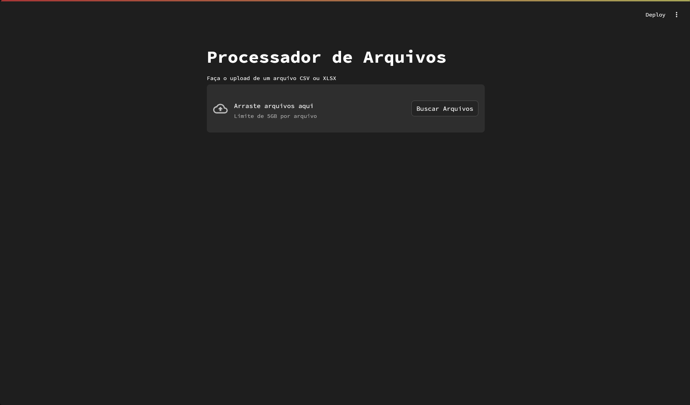
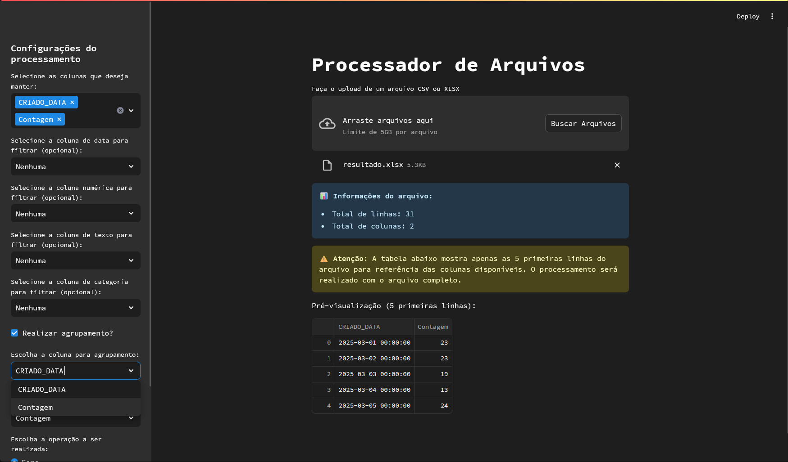
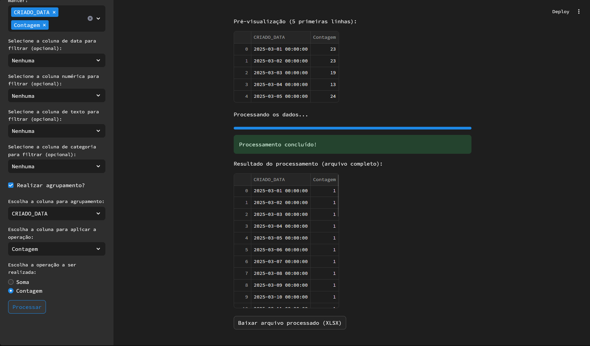

# Processador de Arquivos

Um aplicativo web desenvolvido com Streamlit para processar arquivos CSV e XLSX de forma eficiente, permitindo agrupamento opcional e operações de soma e contagem em grandes conjuntos de dados.

## 🚀 Funcionalidades

- Upload de arquivos CSV, XLSX e suporte a conversão para Parquet
- Visualização prévia dos dados
- Seleção flexível de colunas
- **Filtros avançados**:
  - Filtro por intervalo de datas
  - Filtro por valor numérico
  - Filtro por texto
  - Filtro por categorias
- **Agrupamento opcional**:
  - Soma de valores numéricos
  - Contagem de valores únicos
- Exportação dos resultados em CSV, XLSX ou Parquet
- Interface amigável com barra de progresso
- Suporte a arquivos grandes (até 5GB)
- Limpeza automática de dados da memória ao descartar arquivos

## 📋 Pré-requisitos

```
streamlit
pandas
pyarrow
openpyxl
charset_normalizer
```

## 🔧 Instalação

1. Clone o repositório
2. Instale as dependências:
```bash
pip install -r requirements.txt
```

## 🖥️ Como usar

1. Execute o aplicativo:
```bash
streamlit run processador.py
```

2. Faça o upload de um arquivo CSV ou XLSX
3. Configure os filtros e selecione as colunas desejadas
4. Escolha se deseja realizar agrupamento ou apenas manter as colunas selecionadas
5. Clique em "Processar" para aplicar os filtros e operações
6. Baixe o arquivo processado em CSV ou XLSX

## 🎯 Características Principais

### Interface Personalizada
- Texto em português
- Mensagens informativas sobre o progresso

### Processamento de Dados
- Suporte a arquivos grandes com `low_memory=False`
- Cache de dados para melhor performance
- Visualização prévia limitada a 5 linhas
- Informações sobre total de linhas e colunas

### Operações Disponíveis
- **Soma**: Agrupa e soma valores numéricos
- **Contagem**: Conta valores únicos em cada grupo
- **Sem agrupamento**: Apenas mantém as colunas selecionadas

## ⚠️ Limitações

- Tipos de arquivo suportados: apenas CSV e XLSX
- Limite de tamanho por arquivo: 5GB
- A soma só funciona em colunas numéricas

## 🔍 Detalhes Técnicos

### Componentes Principais
- `st.file_uploader`: Gerencia upload de arquivos
- `pl.read_csv/read_excel`: Lê os arquivos CSV e XLSX
- `pl.DataFrame`: Manipula os dados de forma eficiente
- `st.cache_data`: Otimiza carregamento e processamento de dados
- `groupby`: Realiza operações de agrupamento (opcional)
- `BytesIO`: Gerencia exportação de arquivos
- `pyarrow`: Converte dados para o formato Parquet

## 🖼️ Prints do Aplicativo

### Tela Inicial


### Configuração de Filtros


### Resultado do Processamento


## 📝 Notas de Uso

1. **Performance**
   - Use arquivos CSV para melhor performance
   - Evite selecionar colunas desnecessárias

2. **Memória**
   - O aplicativo carrega o arquivo inteiro na memória
   - Monitore o uso de RAM com arquivos muito grandes

3. **Formatos de Dados**
   - Certifique-se que as colunas numéricas estão no formato correto
   - Verifique a codificação de arquivos CSV

4. **Filtros**
   - **Data**: Selecione uma coluna de data e defina um intervalo.
   - **Valor numérico**: Filtre por valores mínimos e máximos.
   - **Texto**: Filtre por palavras ou frases específicas.
   - **Categorias**: Escolha categorias específicas para filtrar.

5. **Agrupamento**
   - Escolha uma coluna para agrupar os dados.
   - Realize operações de soma ou contagem em outra coluna.

6. **Exportação**
   - Baixe os resultados processados em CSV, XLSX ou Parquet.

## 🤝 Contribuindo

1. Faça um Fork do projeto
2. Crie sua Feature Branch (`git checkout -b feature/AmazingFeature`)
3. Commit suas mudanças (`git commit -m 'Add some AmazingFeature'`)
4. Push para a Branch (`git push origin feature/AmazingFeature`)
5. Abra um Pull Request

## 📄 Licença

Distribuído sob a licença MIT. Veja `LICENSE` para mais informações.
